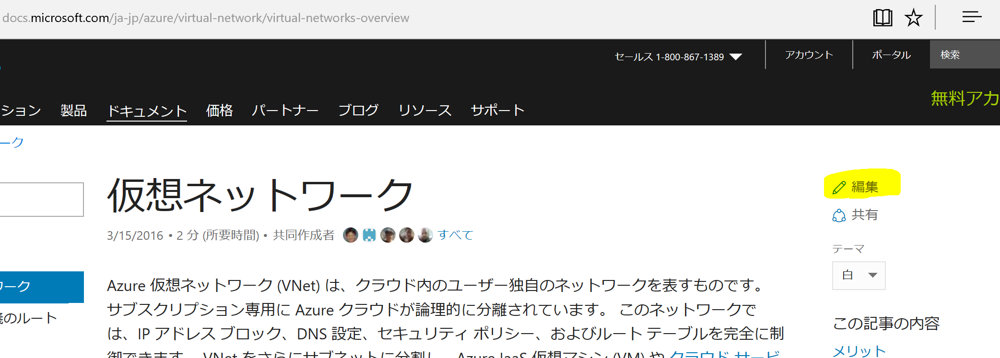
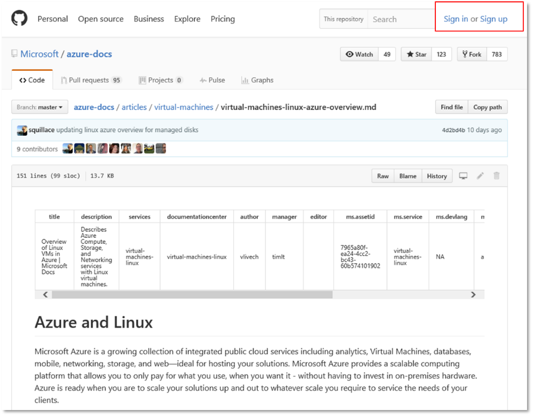
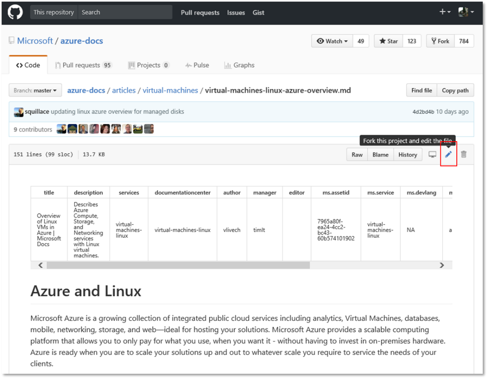
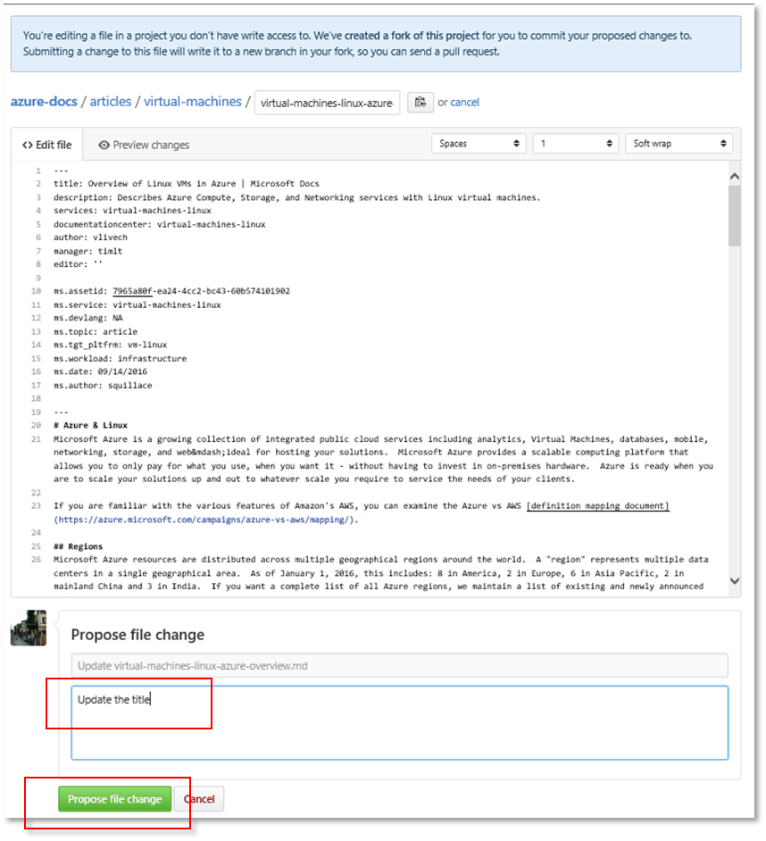
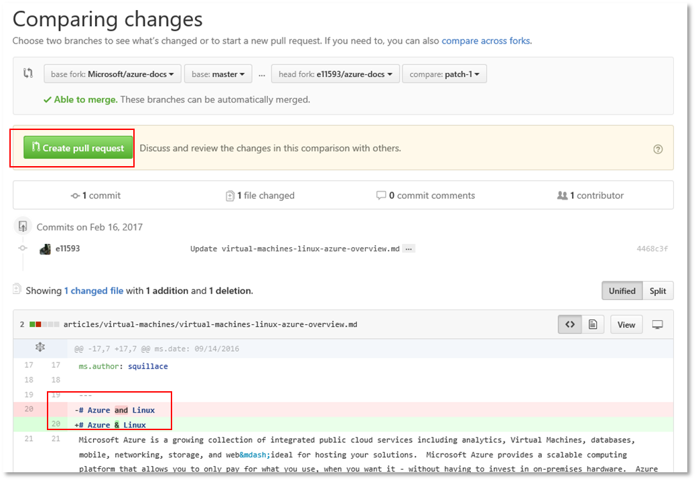

#GitHubを利用して、Docsにあるコンテンツを編集

#### Microsoft

<https://docs.microsoft.com/>に発行されたコンテンツは、GitHubより編集することができます。

GitHubよりDocsにあるページを編集する方法
----------------------------------------

変更をするページにある、\[編集\]ボタンをクリックします。

GitHubのアカウントを既にお持ちの場合、\[サインイン\]をクリックします。アカウントがない場合は、\[サインアップ\]をクリックしてください。

ペンのアイコン（Edit your file in your fork of this project）をクリックし、このプロジェクトに関わるファイルをフォーク（Fork）すると、ページの編集が可能になります。

編集が終わったら、変更理由をコメント欄に記入し、**Propose File Change（ファイルの変更提案）**ボタンをクリックします。

変更箇所が赤と緑で提示されます。

変更内容を確認し、**Create Pull Request（プルリクエストの作成）**ボタンをクリックします。変更箇所が承認され次第、変更箇所はオンラインのページに反映されます。
  ----------------------------------------------------------------------------------------------
[MSDN テクニカルドキュメント章](http://aka.ms/MSDNJapan)
