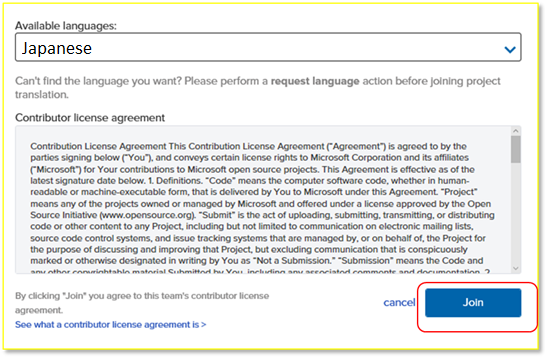
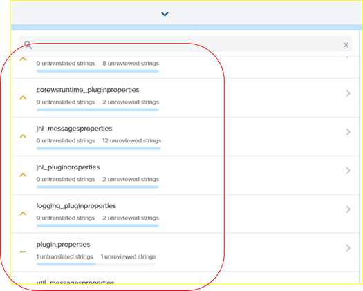
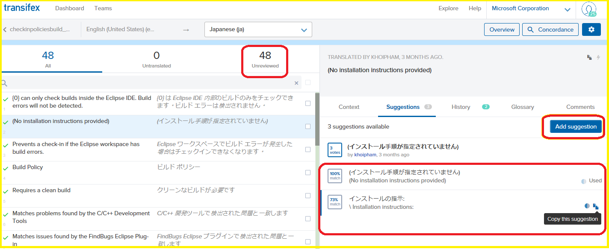
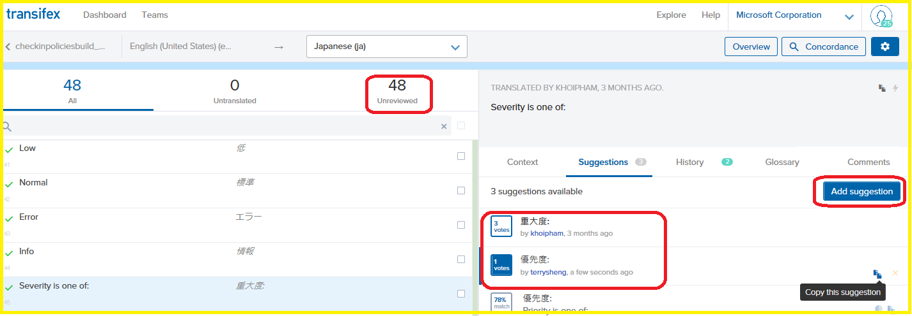

#Transifexを使用して、Open Source にある製品を翻訳

### Microsoft

マイクロソフトでは、以下のオープンソース製品の翻訳に関心がある方のために、サードパーティーの翻訳サイト[Transifex](http://www.transifex.com/)を使用して簡単にフィードバックを送信できる環境を提供しています。

VSCode
- [VSCode Editor](https://www.transifex.com/microsoft-oss/vscode-editor/dashboard/)
- [VSCode Extensions](https://www.transifex.com/microsoft-oss/vscode-extensions/dashboard/)
- [VSCode Workbench](https://www.transifex.com/microsoft-oss/vscode-workbench/dashboard/) 

Linux 版 SQL Server
- [Visual Studio Code SQL Server Extension](https://www.transifex.com/microsoft-oss/vscode-mssql/dashboard/)
- [SQL Tools API Service](https://www.transifex.com/microsoft-oss/sqltoolsservice/dashboard/)

Plug-in for Java Eclipse
- [Team Explorer Everywhere](https://www.transifex.com/microsoft-oss/team-explorer-everywhere/dashboard/)

参加方法 –Transifexに新規登録
-----------------------------

[Transifex](https://www.transifex.com/)にログインします。

Transifexの新規ユーザーの場合、新しいアカウントを新規作成するか、既にあるGitHub、Google、またはLikedInのアカウントよりログインできます。

アクセスをリクエストする
------------------------

**Microsoft**を検索バーに入力し、 製品名を選択します。

ページの右上にある**Join team**（チームに参加）ボタンをクリックします。

編集する言語を選択して、**Join**（参加）ボタンをクリックします。

リクエストが承認され次第、24時間に通知が届きます。

編集参加の手順
----------------------------------------

[Transifex](https://www.transifex.com/)のサイトを開き、言語を選択します。

**Translate**（翻訳）ボタンをクリックします。

ご希望する言語がない場合、ページの右端にある**Request a language**（言語要求）ボタンをクリックします。

リソースの選択
--------------

製品に関する特定のリソースを選択します。

翻訳
----

リソースの下にある翻訳を選択します。
翻訳されていない場合、**Unreviewed**より**Add suggestion**（提案の追加）ボタンを押すと、新しい翻訳を提案できます。

このビューより提案された翻訳を編集することも可能です。

翻訳の投票
----------

既に翻訳されていても、**Unreviewed**（未確認）場合、新たな翻訳を入力し**Add suggestion**（提案の追加）ボタンをクリックするか、既存の翻訳に投票することができます。

新しい提案が最終決定されるには、3票必要です。新しい翻訳はGitHubに毎週更新され、後日ソフトウェアに反映されます。

ご協力ありがとうございます。

  ----------------------------------------------------------------------------------------------
[MSDN テクニカルドキュメント章](http://aka.ms/MSDNJapan)
