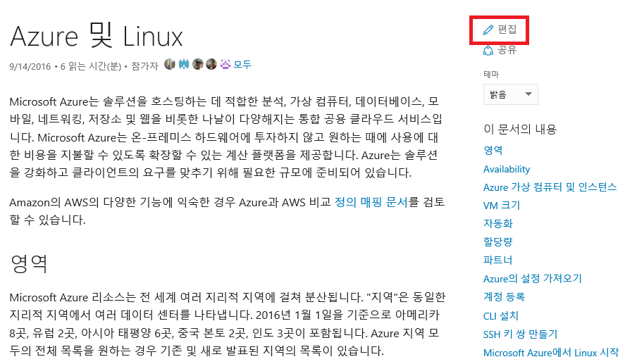
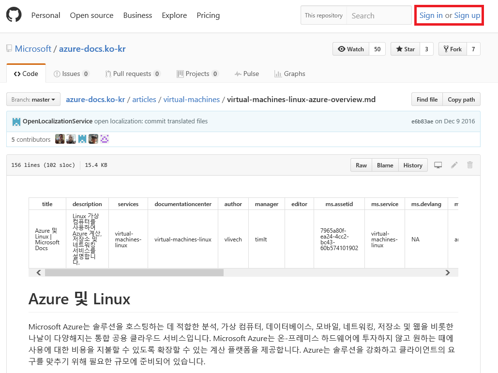
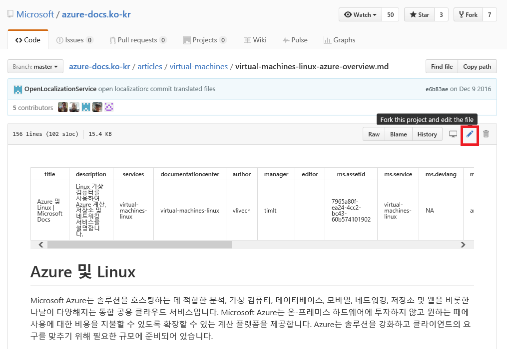
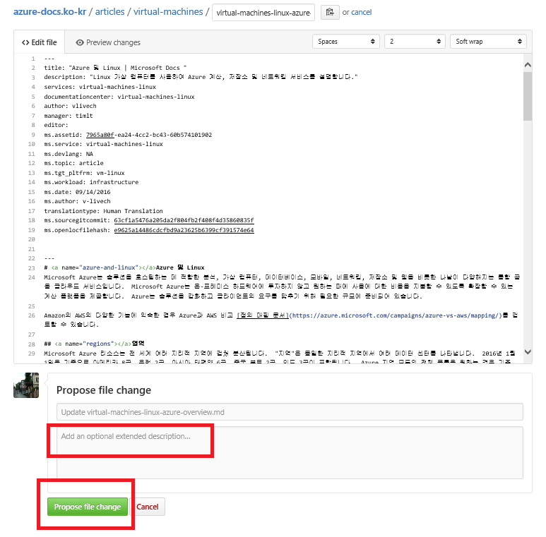

# 깃허브를 사용하여 문서 편집하기

#### Microsoft

<https://docs.microsoft.com/> 에 있는 콘텐츠는 깃허브를 통해서 편집
가능합니다.

깃허브를 사용하여 DOCS 페이지 편집하기
--------------------------------------

업데이트 하시기 원하는 페이지의 ‘**편집’** 링크를 클릭하세요.

깃허브 계정이 있으시면 ‘**Sign in’** 을 클릭하시고, 없으시면 ‘**Sign
up’**을 클릭하세요.

연필 모양 아이콘을 클릭하셔서 프로젝트를 포크(fork) 하시고 파일을
편집합니다.

편집을 하고 ‘**Propose File Change’** 버튼을 클릭하셔서 편집을 끝낼 수
있습니다.

이제 편집한 내용을 보실 수 있습니다.

업데이트 내용을 확인하시고 ‘**Create Pull Request’** 를 클릭합니다.
중재자(moderator)가 승인을 하면 업데이트 내용이 라이브 사이트에 반영이
됩니다.

  ----------------------------------------------------------------------------------------------
[기술 문서](http://aka.ms/MSDNKorea)