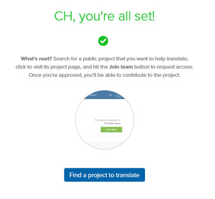
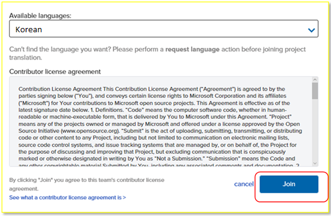
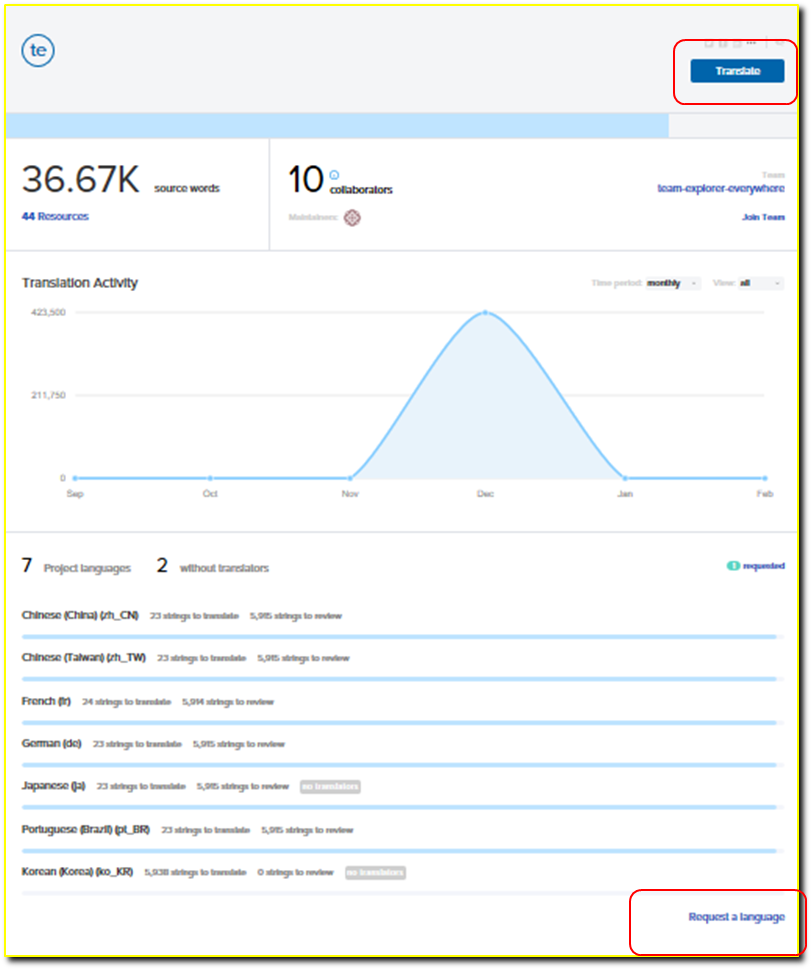
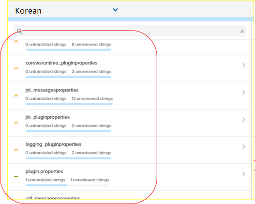
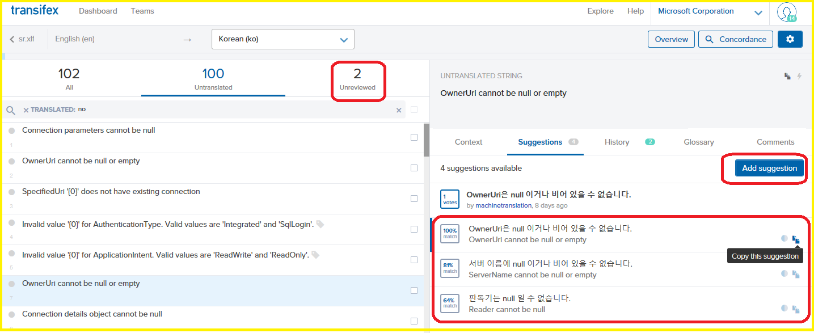
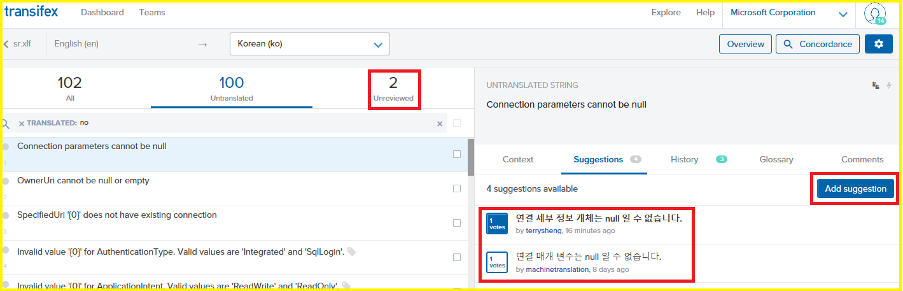

# Transifex를 사용하여 오픈소스 프로젝트 현지화하기

#### Microsoft

소프트웨어 제품을 모국어로 현지화 하고 싶은 열정이 있으신 가요? 마이크로소프트사가 타사의 현지화 플랫폼인 Transifex 에 아래의 오픈소스 제품을 출시하였습니다. 커뮤니티가 Transifex사이트를 사용하여 제품 번역에 대한 피드백과 제안을 하거나 번역을 제공할 수 있습니다.

VSCode
- [VSCode Editor](https://www.transifex.com/microsoft-oss/vscode-editor/dashboard/)
- [VSCode Extensions](https://www.transifex.com/microsoft-oss/vscode-extensions/dashboard/)
- [VSCode Setup](https://www.transifex.com/microsoft-oss/vscode-setup/dashboard/)
- [VSCode Workbench](https://www.transifex.com/microsoft-oss/vscode-workbench/dashboard/) 

SQL on Linux Tools
- [Visual Studio Code SQL Server Extension](https://www.transifex.com/microsoft-oss/vscode-mssql/dashboard/)
- [SQL Tools API Service](https://www.transifex.com/microsoft-oss/sqltoolsservice/dashboard/)

Plug-in for Java Eclipse
- [Team Explorer Everywhere](https://www.transifex.com/microsoft-oss/team-explorer-everywhere/dashboard/)

참여하기- Transifex를 처음 사용하는 경우 
-----------------------------------------

[Transifex](https://www.transifex.com/)에 로그인하기

Transifex를 처음 사용하는 경우, Transifex사이트에서 어카운트를 만들거나,
깃허브, 구글, 링크드인 어카운트를 사용하여 로그인 하실 수 있습니다.

액세스 요청하기 
----------------

‘Microsoft’ 이름과 제품 이름을 검색합니다.

페이지 오른쪽 상단에 있는 ‘**Join team’** 을 클릭합니다.

참여하기 원하는 언어를 선택합니다.

**‘Join’** 버튼을 클릭합니다.

요청이 승인되면 24시간 안에 알림을 받습니다.

시작하기 
---------

[Transifex](https://www.transifex.com/)사이트로 이동합니다.

요청하신 언어를 선택합니다.

**‘Translate’** 을 클릭합니다.

번역하기 원하시는 언어가 없으면, 페이지 오른쪽 하단에 있는 ‘**Request a
language’** 링크를 클릭하세요.

리소스를 선택
-------------

제품에 있는 특정 리소스를 선택합니다.

문자열을 번역하기 
------------------

리소스 아래에 있는 문자열을 선택합니다.

문자열이 ‘**Untranslated’** 되어 있는 경우, ‘**Add suggestion’**을
클릭하여 번역을 제안할 수 있습니다.

채택할 수 있는 다른 번역 제안도 보여 줍니다.

번역 투표하기 
--------------

문자열이 이미 번역 되어있지만, ‘**Unreviewed’** 된 상태라면, ‘**Add
suggestion’**을 클릭하여 직접 다른 번역을 제안하거나, 또는 이미 제안된
번역에 투표하실 수 있습니다.

  ----------------------------------------------------------------------------------------------
[기술 문서](http://aka.ms/MSDNKorea)