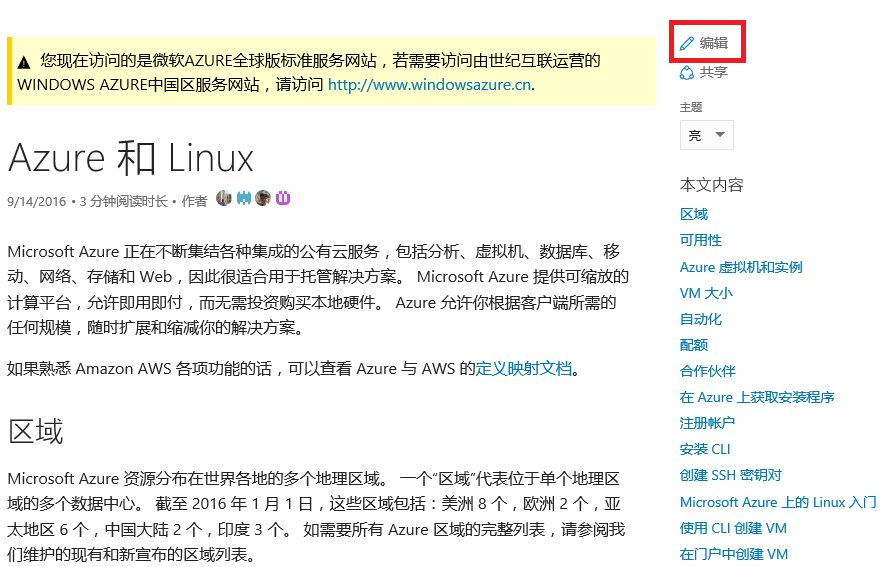
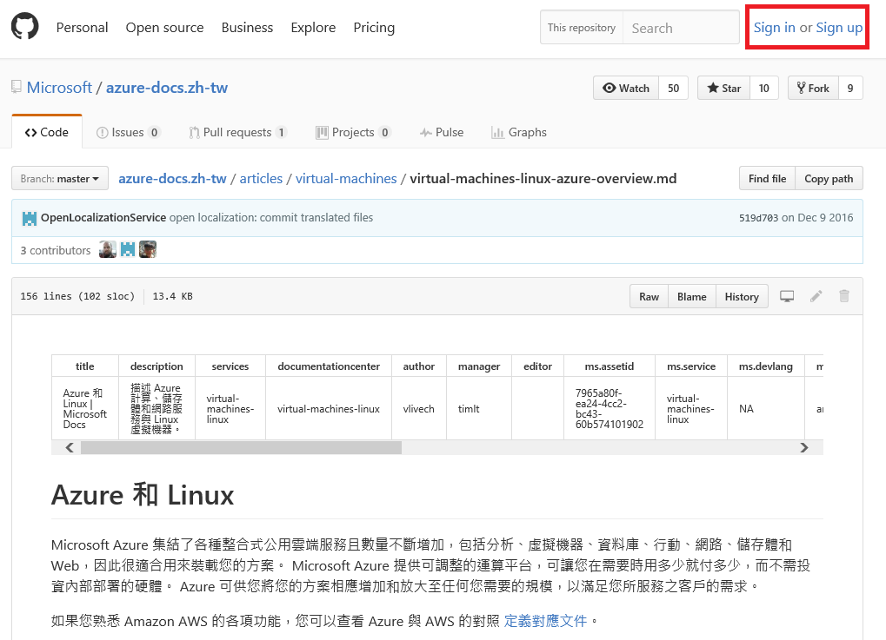
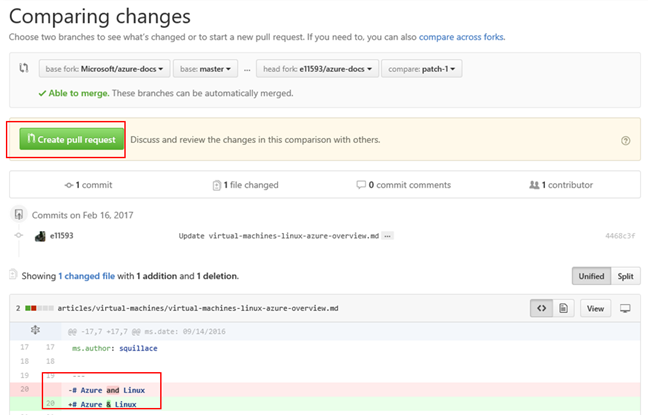

#通过 GitHub 在线编辑 DOCS 技术文章

#### Microsoft

在 <https://docs.microsoft.com/> 的所有技术文章是可以通过 GitHub 在线编辑的!

如何通过 GitHub 在线编辑 DOCS 技术文章
----------------------------------

单击您想要修改的页面右上角的**Edit**链接

如果您已经有 GitHub 账号, 请直接单击 **Sign in**, 否则您可单击 **Sign
up**

接着, 请单击页面右上角的**笔状图示**以编辑该文档

编辑完文档后, 请单击 **Propose File Change**

系统会显示出您编辑过的地方

按 **Create Pull Request** 以确认所做过的编辑

您所编辑的部分一旦被审核通过后就会更新到在线文档。

--- 
[技术文章](http://aka.ms/msdnchina)
