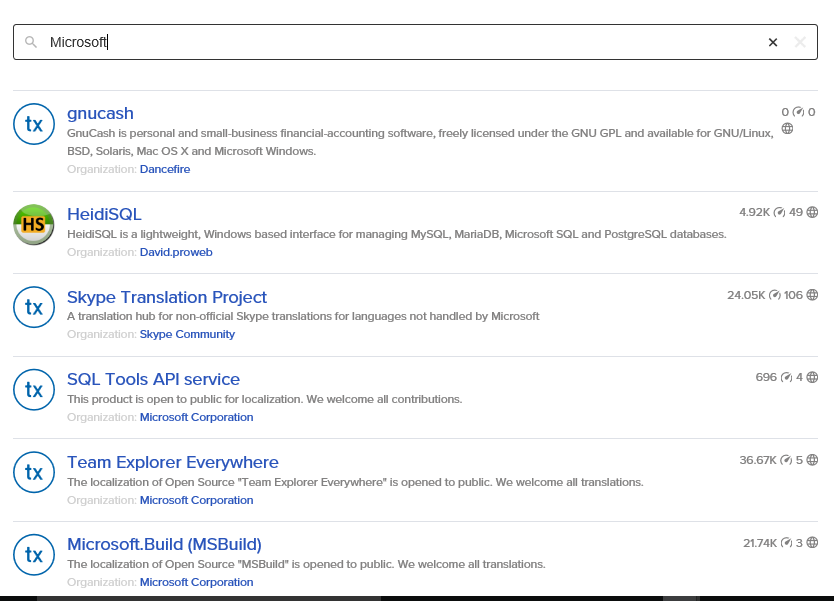
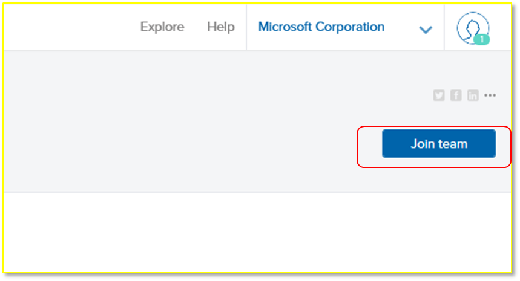
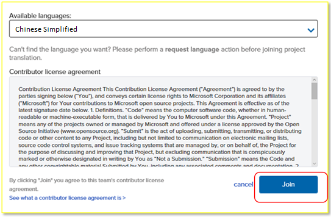
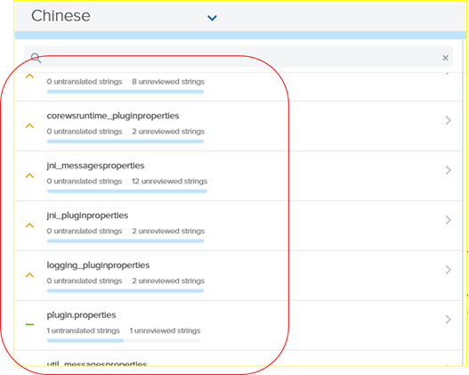
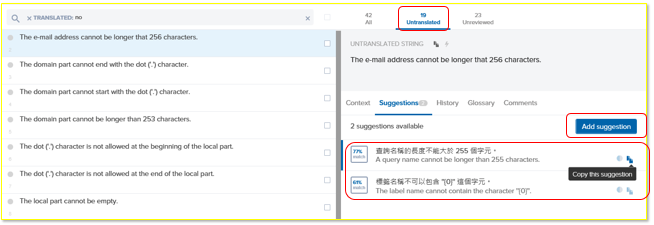
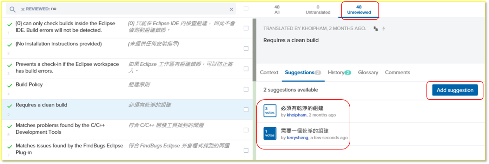

#透过 Transifex 中文化开源软件

#### Microsoft

如果您对于中文化软件充满热情, Microsoft 已经发布了以下的开源产品在
Transifex 平台让社区的伙伴们参与翻译以及审核:

VSCode
- [VSCode Editor](https://www.transifex.com/microsoft-oss/vscode-editor/dashboard/)
- [VSCode Extensions](https://www.transifex.com/microsoft-oss/vscode-extensions/dashboard/)
- [VSCode Setup](https://www.transifex.com/microsoft-oss/vscode-setup/dashboard/)
- [VSCode Workbench](https://www.transifex.com/microsoft-oss/vscode-workbench/dashboard/) 

SQL on Linux Tools
- [Visual Studio Code SQL Server Extension](https://www.transifex.com/microsoft-oss/vscode-mssql/dashboard/)
- [SQL Tools API Service](https://www.transifex.com/microsoft-oss/sqltoolsservice/dashboard/)

Plug-in for Java Eclipse
- [Team Explorer Everywhere](https://www.transifex.com/microsoft-oss/team-explorer-everywhere/dashboard/)

如何参与? – Transifex 的新手
----------------------------

登录 [Transifex](https://www.transifex.com/)

如果您第一次使用 Transifex, 您可以新建立一个账号或是透过您的 GitHub,
Google 或 LinkedIn 账号登录

要求访问权限
------------

搜索 **Microsoft** 以及您想要参与的产品名称

单击页面右上角的 **Join team**

选择中文

单击 Join

如果申请通过, 您将在24小时内收到通知

如何开始参与?
-------------

访问在本文开头叙述过的 Transifex 产品项目网址

选择中文

按 **Translate**

如果该产品还未开始被中文化, 您可以在页面右下角按 **Request a language**
加入中文

选择 Resource
-------------

接下来, 您可以选择一项您想要参与中文化的 resource

翻译句子
--------

在被选择的resource下选择想要翻译的句子

如果该句子还没被任何人翻译过 **(Untranslated)**, 单击 **Add
suggestion**, 您即可输入您建议的翻译

Transifex 也会提示可能的翻译让您采用

替既有的翻译投票
----------------

如果该句子已经被其他人翻译过, 但还未被管理者审核 (**Unreviewed**),
您仍然可以按 **Add suggestion** 输入另一个您觉得更适合的翻译.

或者, 如果您觉得其中任何一句既有的翻译是正确的,
即可单击该句子旁的投票方块以增加其票数

--- 
[技术文章](http://aka.ms/msdnchina)
