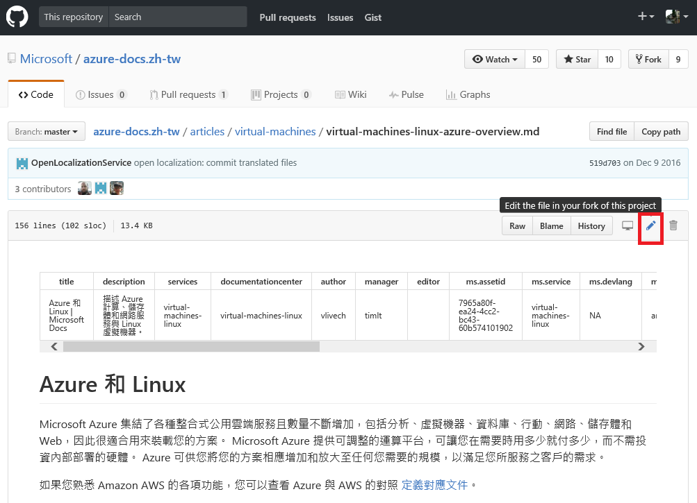
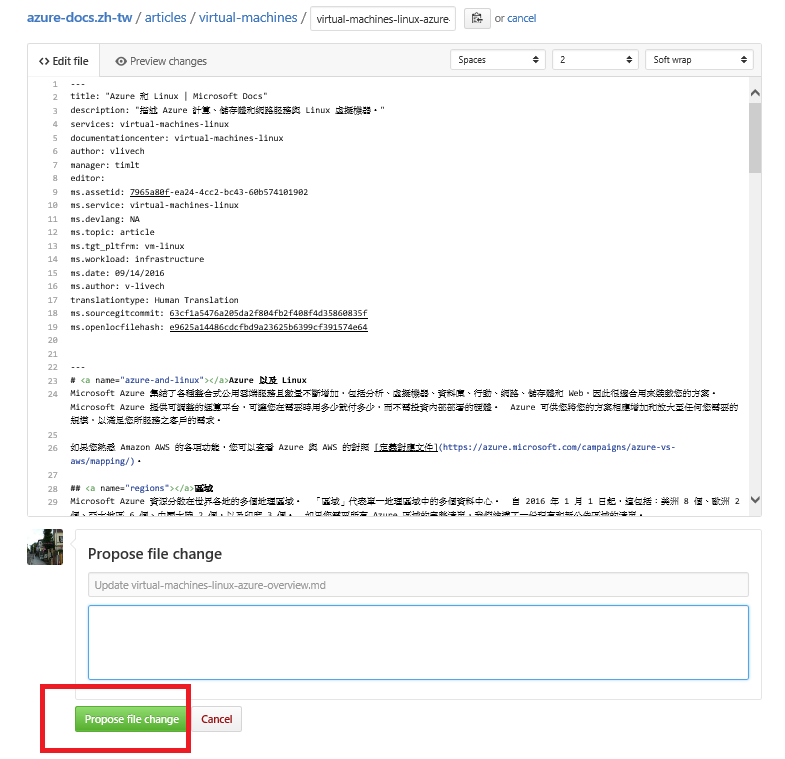

#通過 GitHub 編輯 DOCS 技術文章

#### Microsoft

在 <https://docs.microsoft.com/> 的所有技術文章是可以透過 GitHub
來編輯的!

如何透過 GitHub 編輯 DOCS 技術文章
----------------------------------

按一下您想要修改的頁面右上角的**編輯**連結

如果您已經有 GitHub 帳號, 請直接按一下 **Sign in**, 否則您可按 **Sign
up**

接著, 請按一下頁面右上角的**筆狀圖示**以編輯該檔案

編輯完檔案後, 請按 **Propose File Change**

系統會顯示出您編輯過的地方

按 **Create Pull Request** 以確認所做過的編輯

您所編輯的部分一旦被審核通過後即發表在線上

  ----------------------------------------------------------------------------------------------
[技術文章](http://aka.ms/MSDNTaiwan)