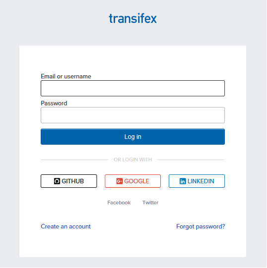
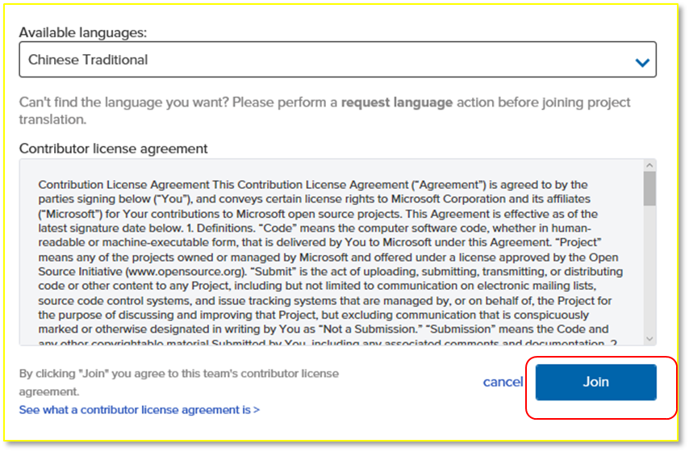

#透過 Transifex 中文化開放原始碼軟體

#### Microsoft

如果您對於中文化軟體產品充滿熱情, Microsoft
已經發佈了以下的開放原始碼產品在 Transifex 平台讓社群們參與翻譯以及審核:

VSCode
- [VSCode Editor](https://www.transifex.com/microsoft-oss/vscode-editor/dashboard/)
- [VSCode Extensions](https://www.transifex.com/microsoft-oss/vscode-extensions/dashboard/)
- [VSCode Setup](https://www.transifex.com/microsoft-oss/vscode-setup/dashboard/)
- [VSCode Workbench](https://www.transifex.com/microsoft-oss/vscode-workbench/dashboard/) 

SQL on Linux Tools ()
- [Visual Studio Code SQL Server Extension](https://www.transifex.com/microsoft-oss/vscode-mssql/dashboard/)
- [SQL Tools API Service](https://www.transifex.com/microsoft-oss/sqltoolsservice/dashboard/)

Plug-in for Java Eclipse
- [Team Explorer Everywhere](https://www.transifex.com/microsoft-oss/team-explorer-everywhere/dashboard/)

如何參與? – Transifex 的新手
----------------------------

登錄 [Transifex](https://www.transifex.com/)

如果您第一次使用 Transifex, 您可以新建立一個帳號或是透過您的 GitHub,
Google 或 LinkedIn 帳號登錄

要求存取權限
------------

搜尋 **Microsoft** 以及您想要參與的產品名稱

按一下頁面右上角的 **Join team**

選擇中文

按一下 Join

如果申請通過, 您在24小時內會收到通知

如何開始參與?
-------------

訪問在本文開頭敘述過的 Transifex 產品專案網址

選擇中文

按 **Translate**

如果該產品還未開始被中文化, 您可以在頁面右下角按 **Request a language**
加入中文

選擇 Resource
-------------

接下來, 您可以選擇一項您想要參與中文化的 resource

翻譯句子
--------

在被選擇的resource下選擇想要翻譯的句子

如果該句子還沒被任何人翻譯過 **(Untranslated)**, 按一下 **Add
suggestion**, 您即可輸入您建議的翻譯

Transifex 也會提示可能的翻譯讓您採用

替既有的翻譯投票
----------------

如果該句子已經被其他人翻譯過, 但還未被管理者審核 (**Unreviewed**),
您仍然可以按 **Add suggestion** 輸入另一個您覺得更適合的翻譯.

或者, 如果您覺得其中任何一句既有的翻譯是正確的,
即可按一下該句子旁的投票方塊以增加其票數

  ----------------------------------------------------------------------------------------------
[技術文章](http://aka.ms/MSDNTaiwan)